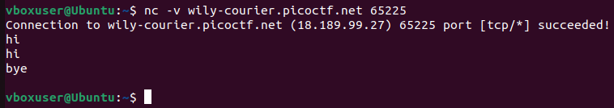
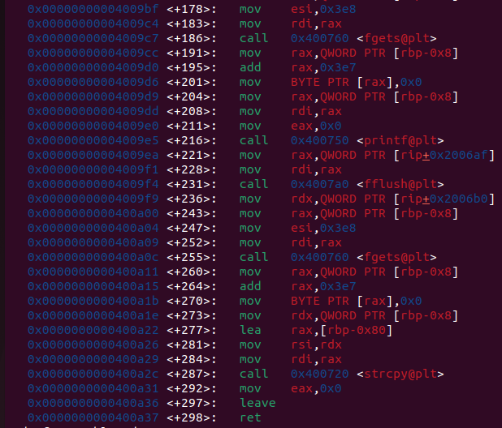
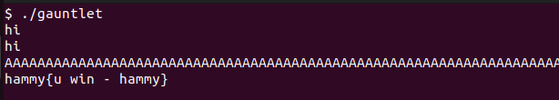

# Binary Gauntlet 0
Challenge Description:
> This series of problems has to do with binary protections and how they affect exploiting a very simple program. How far can you make it in the gauntlet? The flag for this challenge does not include the standard picoCTF{} wrapper.

Difficulty: <b>Medium</b>

<b>[Jump to solution](#solution)</b>

## Hints
No hints were provided by the challenge author for this challenge, so here's some hints from me for anyone looking for a lead:

Hint 1

> Try disassembling main in gdb and looking at what functions are being called, particularly from offset <+186> and onward. Are any of them known to be vulnerable?

Hint 2

> The flag isn't in the standard picoCTF format. It'll appear as a hexadecimal sequence.

## Procedure
The challenge description and lack of hints give us nothing to go off of (not even a source code file), so we simply begin by running the provided binary and/or connecting to the challenge endpoint.

> 

It looks like the program takes an input, echoes the input back, then seemingly takes a second input before terminating. Disassembling the program in gdb more or less confirms this:

> 

There is one call to fgets followed by a call to printf, and one more call to fgets followed by a call to strcpy. The call the printf seems to be the one to echo our input from the first fgets, and the second fgets feeds our second input into strcpy, which is known to be prone to overflows. 

We can simply try entering a whole load of bogus for the second input to see if we can indeed overflow the buffer.

> 

And it prints the flag! We don't really get a confirmation that we can overflow the buffer, but we can assume this introductory challenge has a segfault handler that simply prints the flag.

## Solution
1. Enter whatever you want for the first input, at most 999 bytes including the newline.
2. Enter at least 135 non-null bytes for the second input to overflow the return address.

Alternative solutions: Anything that causes a segfault will print the flag since the segfault handler is set to print the flag. That means entering enough %s specifiers for the first input will print the flag immediately.

## Key Takeaways
Not much to be taken away from this challenge. Many introductory binary exploitation problems try to introduce overflows to you with no precision needed, so spamming the buffer enough wins a lot of them.
