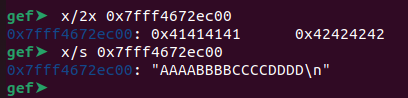
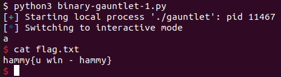

# Binary Gauntlet 1
Challenge Description:
> Okay, time for a challenge. The flag for this challenge does not include the standard picoCTF{} wrapper.

Difficulty: <b>Medium</b>

<b>[Jump to solution](#solution)</b>

## Hints
No hints were provided by the challenge author for this challenge, so here's some hints from me for anyone looking for a lead:

Hint 1

> The address the program prints isn't random. Try seeing what is contained there during program execution!

Hint 2

> Shellcode

## Procedure
The program is almost identical to that of Binary Gauntlet 0, except with two changes:
1. The program leaks a stack address before asking for input
2. It now only takes 120 bytes to reach the return address from the second input

So what exactly is the address leaked by the program at the start? We can check in gdb; below shows an examination of the address leaked by the program with a second input of "AAAABBBBCCCCDDDD":
> 

We can conclude the leaked address is the address of our input! Additionally, according to `checksec`, the NX bit might not be set, meaning we can jump to code placed on the stack and execute it.

With this, the plan of attack is straightforward. In `binary-gauntlet-1.py`, I used a 43-byte shellcode I made from a pwn class I took in university, which runs an unnecessary call to setregid since I needed it during the class. But hey, it works here too!
> 

## Solution
1. Record the leaked stack address given by the program. This is the address of the input buffer for your second input, which we want to return to.
2. Enter whatever you want for the first input, at most 999 bytes including the newline.
3. Place amd64 shellcode on the stack with your second input (max 120 bytes) and simultaneously overflow the return address to jump to your shellcode.

Alternative solutions: You can leak a relevant stack address yourself by exploiting the format string vulnerability controlled by the first input.

## Key Takeaways
I find that exploits involving shellcode might not be 100% reliable or work on every run (or, my shellcode just sucks). If you're certain you're returning to the shellcode properly but it doesn't work after a few tries, try another variation of the shellcode.