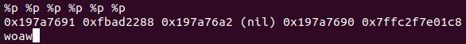
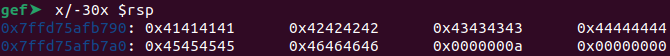
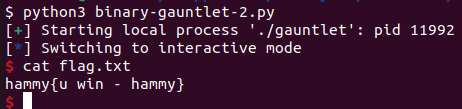
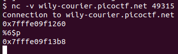

# Binary Gauntlet 2
Challenge Description:
> How does ASLR affect your exploit? The flag for this challenge does not include the standard picoCTF{} wrapper.

Difficulty: <b>Medium</b>

<b>[Jump to solution](#solution)</b>

## Hints
No hints were provided by the challenge author for this challenge, so here's some hints from me for anyone looking for a lead, <b>especially those having trouble getting their exploit working on the remote target:</b>

Hint 1

> This challenge is identical to Binary Gauntlet 1 (stack layout and all) except it doesn't leak an address anymore. Leak it yourself, and debug using Binary Gauntlet 1 since you're certain of where your input is actually located there!

## Procedure
From the challenge description, we can tell ASLR is on (well, it was already on for the previous challenges...). The program also does not leak a stack address for us anymore!

Because the first input gets echoed back to us, we can try to see if the print statement has a format string vulnerability:
> 

And it looks like there is! The 6th address leaked in the image looks like a stack address, so we can shorten our first input to `%6$p` to leak the 6th address directly.

So now the question is... where is our input relative to this address? We can run the program in gdb with a breakpoint placed at the return to examine the stack:

> 

In the image above, we leaked an address `0x7ffd75afb918` using input `%6$p` and find our input of `AAAABBBBCCCCDDDDEEEEFFFF` at `0x7ffd75afb790`.

Therefore, the offset from the leaked address to our input is `0x7ffd75afb918 - 0x7ffd75afb790 = 0x188` bytes - in other words, the leaked address minus 0x188 brings us to our input on the stack!

All that's left to do is place our shellcode on the stack and return to it just as we have in Binary Gauntlet 1, which works swimmingly locally.

> 

Now, if you're reading this and haven't solved this challenge, you're here because your exploit works locally but not on the remote machine. Don't worry! Let's pay a visit back to Binary Gauntlet 1, which is actually identical to Binary Gauntlet 2 except that it leaks the input address for us.

> 

If you run the math, the offset of the leaked address (lower) from the input buffer (upper) on the remote machine is actually `0x7fffe09f13b8 - 0x7fffe09f1260 = 0x158`, NOT `0x188` as I had locally! So if your shellcode for Binary Gauntlet 1 works, it should work in part 2 when you adjust the offset from 0x188 (or whatever you found locally) to 0x158.

## Solution
1. Leak a stack address (likely prefixed by 0x7ff) with your first input using %p format specifier(s). `%6$p` is an input that can consistently leak a stack address.
2. In a debugger like gdb, determine where this leaked address is relative to the address of your second input. You can do this by placing a breakpoint at the return of main with `b *main+160` and examining the stack around `$rsp` at that point to locate your input's address. From there, calculate the offset of the leaked address from your input's address.
3. Re-run the program, using the first input to leak a stack address to calculate the address of your input with the offset found in step 2. The offset on the remote machine is `0x158`.
4. Place your shellcode on the stack with the second input and simultaneously overwrite the return address to return to it.

## Key Takeaways
I spent a long time trying to debug my exploit and fuzz the stack offset on the remote machine when I realized I could just debug with Binary Gauntlet 1. Ooops