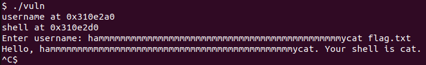
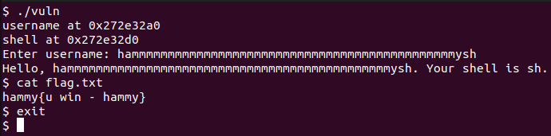

# Input Injection 2
Challenge Description:
> This program greets you and then runs a command. But can you take control of what command it executes?

CTF: <b>picoCTF</b> (picoGym)<br>Difficulty: <b>Medium</b>

<b>[Jump to solution](#solution)</b>

## Hints
Here are the hints provided by the challenge author.
<details>
<summary>Hint 1</summary>

> Notice how username and shell are both heap-allocated.
</details>
<details>
<summary>Hint 2</summary>

> Offsets often hide in the memory addresses you see at runtime.
</details>
<details>
<summary>Hint 3</summary>

> Try to overwrite what command gets executed.
</details>

## Procedure
Running the program shows that this is just a not-so-different flavor of Input Injection 1.
```
username at 0x141ba2a0
shell at 0x141ba2d0
Enter username: hammy
Hello, hammy. Your shell is /bin/pwd.
[my working directory is printed here]
```
The program output shows that our input is at a lower address than the address of the command string (48 bytes lower). Moreover, these don't look like stack addresses or code addresses, so we can assume they are heap addresses.

Based on the placement of our username and shell buffers, we might be able to overflow the shell buffer with our username. Let's try it!!
> 

Odd, so it looks like the command gets cut off at any space characters. This means we can't simply run `cat flag.txt`, but we can just run `sh` instead.
> 

Since I could exit without exiting back to my normal command line, it shows an extra shell was spawned (trust me)

## Solution
1. Input any name exactly 48 bytes long followed by `sh` (or whatever other non-spaced system command you desire), e.g. `hammmmmmmmmmmmmmmmmmmmmmmmmmmmmmmmmmmmmmmmmmmmmysh`
2. Use the spawned shell to `cat flag.txt`

## Key Takeaways
There are probably many ways to perform one task in the shell, and harder challenges in the future will probably place restrictions on how you can format your commands.