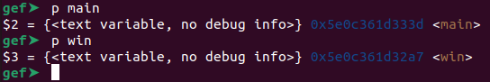
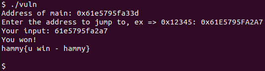

# PIE TIME
Challenge Description:
> Can you try to get the flag? Beware we have PIE!

CTF: <b>picoCTF</b> (picoGym)<br>Difficulty: <b>Easy</b>

<b>[Jump to solution](#solution)</b>

## Hints
Here are the hints provided by the challenge author.
<details>
<summary>Hint 1</summary>

> Can you figure out what changed between the address you found locally and in the server output?
</details>

## Procedure
Running the program gives us the code address of main, and asks where we would like to jump to.
```
Address of main: 0x6176a5da133d
Enter the address to jump to, ex => 0x12345: fffffffffffffffff
Your input: ffffffffffffffff
Segfault Occurred, incorrect address.
```
Looking at the source and in gdb, we can see the program has a `win` function which should have a constant distance/offset from `main`. Since the program leaks the address of `main`, we can simply calculate the address of `win` based on that and jump to `win`.

> 

So, the offset of `main` from `win` is `0x5e0c361d333d - 0x5e0c361d32a7 = 0x96` bytes. In other words, subtract 0x96 from the leaked main address and jump there.

> 

## Solution
1. Find the distance (offset) between the `main` and `win` functions in gdb.
2. Run the program and calculate the address of `win` based on the leaked address of `main`.
3. Input the address of `win` as your jump destination.

## Key Takeaways
Even with basic PIE enabled, functions may still have a constant offset from each other.