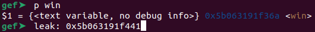
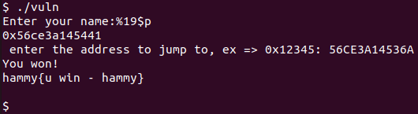
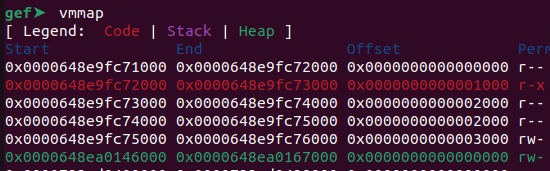

# PIE TIME 2
Challenge Description:
> Can you try to get the flag? I'm not revealing anything anymore!!

CTF: <b>picoCTF</b> (picoGym)<br>Difficulty: <b>Medium</b>

<b>[Jump to solution](#solution)</b>

## Hints
Here are the hints provided by the challenge author.
<details>
<summary>Hint 1</summary>

> What vulnerability can be exploited to leak the address?
</details>
<details>
<summary>Hint 2</summary>

> Please be mindful of the size of pointers in this binary
</details>

## Procedure
Running the program asks us for our name, echoes our name back to us, and then asks us what address we want to jump to.
```
Enter your name:hammy
hammy
 enter the address to jump to, ex => 0x12345: 12345
Segfault Occurred, incorrect address.
```
Because the program echoes our name back to us, we might be interested in seeing if the echo has a format string vulnerability.
```
Enter your name:%p %p %p %p %p %p
0x609b135972a1 0xfbad2288 0x609b135972b2 (nil) 0x609b135972a0 0x60
 enter the address to jump to, ex => 0x12345: 
```
It does! So, we can abuse this vulnerability to leak a relevant code address. In the image above, it looks like we leaked some code addresses, but these don't have a constant offset from the `win` function. After some testing, I found one at argument 19 that does: `%19$p`

> <br>

When running the program in gdb, the leaked address was `0x5b063191f441` and the address of `win` was `0x5b063191f36a`, meaning the offset of the leak from `win` was `0x5b063191f441 - 0x5b063191f36a = 0xd7`.

Therefore, the address of `win` is the address leaked by `%19$p` minus `0xd7`.

> 

## Solution
1. Run the program in gdb, and leak a code address by abusing the format string vulnerability by setting your name as `%19$p`.
2. In gdb, find the offset between the leaked code address and `win`.
3. Calculate the address of `win` based on the leaked address and input that address to jump to.

## Key Takeaways
Some code addresses look like code addresses but don't have constant offsets from functions of interest, probably due to being in different sections of memory.

> 