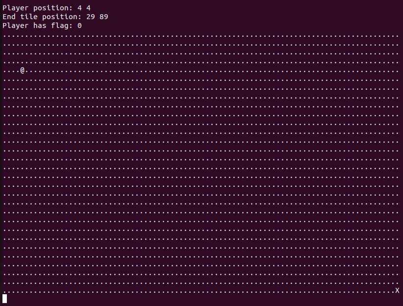
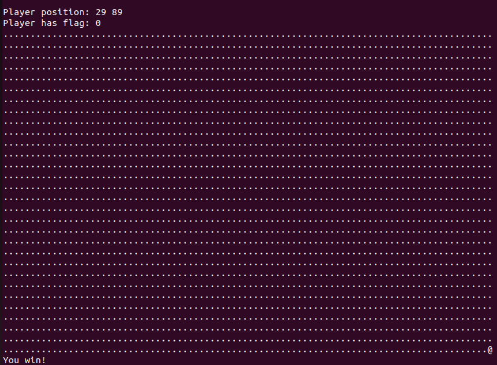
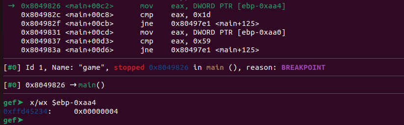
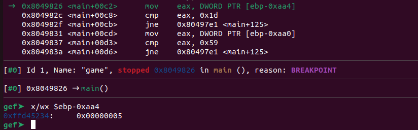
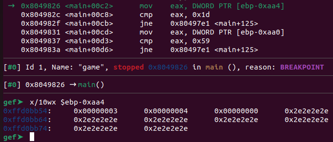

# babygame01
Challenge Description:
> Get the flag and reach the exit.

CTF: <b>picoCTF</b> (picoGym)<br>Difficulty: <b>Medium</b>

<b>[Jump to solution](#solution)</b>

## Hints
Here are the hints provided by the challenge author.
<details>
<summary>Hint 1</summary>

> Use 'w','a','s','d' to move around.
</details>
<details>
<summary>Hint 2</summary>

> There may be secret commands to make your life easy.
</details>

## Procedure
In hindsight, I personally played this challenge like a reverse engineering challenge as opposed to binary exploitation (especially since we don't get the source). Upon running the binary, we get a little map printed out. Figuring out how to even play the game is the first step, and by reading Hint 1, messing around, or dissecting `move_player` in gdb we can discover the controls of the game.
- Use w, a, s, d in your inputs to create a sequence of movements.
> 

We can freely move around the board, and when reaching the "end tile" we get a `You win` message and the program exits.
> 

So we can assume the goal is to find the "flag" on the map, navigate to it, and then navigate to the end tile. But after brute-force searching the map, we can conclude there is no flag tile to be found! 

Moreover, we can discover that we can move <i>more than</i> freely on this board... if you move beyond the top boundary (spamming w), beyond the bottom boundary (spamming s), or beyond the top left corner (moving to the top left and pressing a or w), you move off the map. So either there is no flag, or the flag is hidden on some random off-screen tile. Either way, I think there is more investigation to be done.

At this point if you mess around off-screen enough, you'll find out you've suddenly won. But let's dig a little deeper for the sake of exercising some reversing in gdb. When running `info func` in gdb, we can see there's a `win` function. 

```
gef➤  info func
All defined functions:

Non-debugging symbols:
...
0x08049233  win
0x080492c8  init_map
0x0804936e  find_player_pos
0x080493e4  find_end_tile_pos
0x08049454  print_flag_status
0x0804948a  print_map
0x0804953a  init_player
0x08049564  move_player
0x08049639  clear_screen
0x08049677  solve_round
0x08049764  main
... 
```

Great, somewhere concrete to work backwards from. So the next step is finding out what calls `win`, and luckily the answer is easy: `main`.
```
0x080497e1 <+125>:	call   0x8049070 <getchar@plt>
...
0x08049805 <+161>:	call   0x8049564 <move_player>
...
0x08049810 <+172>:	lea    eax,[ebp-0xaa4]
0x08049816 <+178>:	push   eax
0x08049817 <+179>:	lea    eax,[ebp-0xa98]
0x0804981d <+185>:	push   eax
0x0804981e <+186>:	call   0x804948a <print_map>
...
0x08049826 <+194>:	mov    eax,DWORD PTR [ebp-0xaa4]
0x0804982c <+200>:	cmp    eax,0x1d
0x0804982f <+203>:	jne    0x80497e1 <main+125>
0x08049831 <+205>:	mov    eax,DWORD PTR [ebp-0xaa0]
0x08049837 <+211>:	cmp    eax,0x59
0x0804983a <+214>:	jne    0x80497e1 <main+125>
...
0x0804983f <+219>:	lea    eax,[ebx-0x1f78]
0x08049845 <+225>:	push   eax
0x08049846 <+226>:	call   0x80490c0 <puts@plt>
...
0x0804984e <+234>:	movzx  eax,BYTE PTR [ebp-0xa9c]
0x08049855 <+241>:	test   al,al
0x08049857 <+243>:	je     0x8049884 <main+288>
0x08049859 <+245>:	sub    esp,0xc
0x0804985c <+248>:	lea    eax,[ebx-0x1f6f]
0x08049862 <+254>:	push   eax
0x08049863 <+255>:	call   0x80490c0 <puts@plt>
0x08049868 <+260>:	add    esp,0x10
0x0804986b <+263>:	call   0x8049233 <win>
```
From the snippet of disassembly above, we can conclude `main` performs the following actions, probably on a loop:
1. Call `move_player` to process a character of movement input
2. Call `print_map` to print the new state of the map
3. Compare a value stored at `$ebp-0xaa4` to `0x1d = 29`, restarting the loop if `$ebp-0xaa4 != 29`.
4. Compare a value stored at `$ebp-0xaa0` to `0x59 = 89`, restarting the loop if `$ebp-0xaa0 != 89`.
5. Print out something using `puts` if the loop isn't restarted.
6. Check to see if the value stored at `$ebp-0xa9c` is equal to 0, <i>skipping over </i>`win`<i> if so</i>.

So we have a list of conditions to fulfill in order to call `win`:
1. `$ebp-0xaa4 == 29`
2. `$ebp-0xaa0 == 89`
3. `$ebp-0xa9c != 0`

Let's begin by seeing if we control `$ebp-0xaa4` by placing a breakpoint at `*main+194` and examining its value when we hit the breakpoint. When using `d` as our first input, the value stored there is 0x4.
> 

Okay, what about inputting `s`?
> 

It changed to 5! It might be tied to our y coordinate on the map - inputting four more `s`s changes the value to 9, so it's most likely storing our y coordinate there.

The process of analyzing `$ebp-0xaa0` is similar, and we can discover this holds our x coordinate. So the question now is, what is `$ebp-0xa9c`? Given that we want it to be nonzero to `win`, we can assume this is the flag that indicates if we have the flag or not.

If we take a look at these addresses on the stack, they all happen to be adjacent to each other! Along with... a bunch of spam?
> 

The spam, 0x2e, turns out to be the character `.`, which is most likely the map. So our coordinates, the flag value, and the map are all stored next to each other.

Now we should ask ourselves... can we take advantage of the position of these values on the stack at all? This is when the out-of-bounds bug described earlier comes into play.

Let's position ourselves at the top left corner so our coordinates are (0,0), and examine the values on the stack.
```
gef➤  x/10wx $ebp-0xaa4
0xffd0bb54:	0x00000000	0x00000000	0x00000000	0x2e2e2e40
0xffd0bb64:	0x2e2e2e2e	0x2e2e2e2e	0x2e2e2e2e	0x2e2e2e2e
0xffd0bb74:	0x2e2e2e2e	0x2e2e2e2e
```
Our player icon, `@ = 0x40`, seems to also be present on the stack. What happens if we input `a` and clip beyond the top left boundary?
```
gef➤  x/10wx $ebp-0xaa4
0xffd0bb54:	0x00000000	0xffffffff	0x40000000	0x2e2e2e2e
0xffd0bb64:	0x2e2e2e2e	0x2e2e2e2e	0x2e2e2e2e	0x2e2e2e2e
0xffd0bb74:	0x2e2e2e2e	0x2e2e2e2e
```
Uh oh! Our x coordinate is now in the negatives, and the flag value was changed from 0 to 0x40000000! What if we input three more `a`s?
```
gef➤  x/10wx $ebp-0xaa4
0xffd0bb54:	0x00000000	0xfffffffc	0x2e2e2e40	0x2e2e2e2e
0xffd0bb64:	0x2e2e2e2e	0x2e2e2e2e	0x2e2e2e2e	0x2e2e2e2e
0xffd0bb74:	0x2e2e2e2e	0x2e2e2e2e
```
It looks like the map string is bleeding into the other values... and if we take a look at the map, we can actually see:
```
End tile position: 29 89
Player has flag: 64
```
Moving any farther left actually causes the map to bleed into our coordinates and crash the program, but we have what we want - a nonzero "player has flag" value! So let's just move to the end tile :)
```
Player position: 29 89
Player has flag: 46

[map]
You win!
flage
hammy{u win - hammy}
```

Along the way, I discovered the "secret commands" hint 2 was referencing. 
- The command `l[char]` where `[char]` is any character will set your player icon to that character. For example, `lA` replaces your `@` icon with `A`.
- The command `p` instantly moves you to the end tile (bottom right).

Setting your icon to `X` confuses the game's knowledge of where the end tile is located, but this did nothing useful for me.
## Solution
1. Move to the top left of the map (0,0), then move four steps to the left.
2. Move back onto the map by taking four steps to the right and navigate to the end tile to win the flag.
    - Winning input: `wwwwaaaaaaaap`

## Key Takeaways
I forget that early/introductory game challenges like this can be solved by just screwing around. Luckily I could sharpen my gdb skills a bit when overanalyzing this challenge.