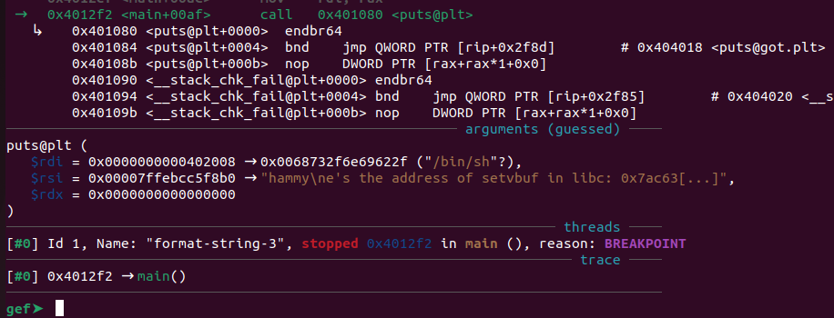
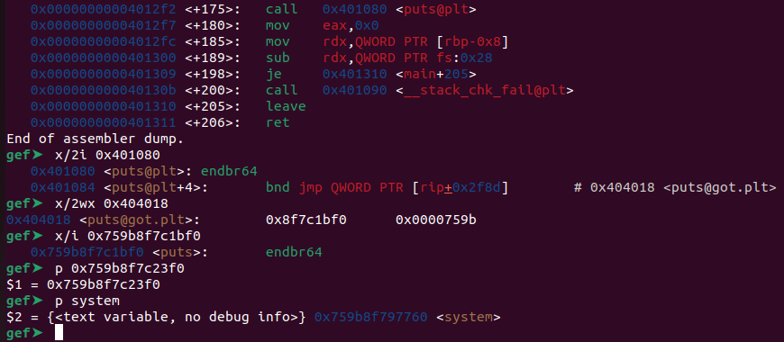
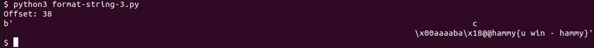

# format string 3
Challenge Description:
> This program doesn't contain a win function. How can you win?

CTF: <b>picoCTF</b> (picoGym)<br>Difficulty: <b>Medium</b>

<b>[Jump to solution](#solution)</b>

## Hints
Here are the hints provided by the challenge author.
<details>
<summary>Hint 1</summary>

> Is there any way to change what a function points to?
</details>

## Procedure
The program leaks the address of libc's setvbuf function, and prompts us for input which is echoed back to us. Right after, `/bin/sh` is printed to the screen for some reason.
```
$ ./format-string-3
Howdy gamers!
Okay I'll be nice. Here's the address of setvbuf in libc: 0x7a9de004f3f0
hammy
hammy
/bin/sh
$ 
```

Taking a look in gdb (or the source), we can see the `/bin/sh` string is printed as the result of a call to `puts`.

> 
```c
int main() {
	char *all_strings[MAX_STRINGS] = {NULL};
	char buf[1024] = {'\0'};

	setup();
	hello();	

	fgets(buf, 1024, stdin);	
	printf(buf);

	puts(normal_string);

	return 0;
}
```
No "win" function is visible in either gdb nor the source, so the solution must be something a bit more roundabout. Conveniently, the call to `puts` shows it uses a pointer to a string `/bin/sh` as an argument. Perhaps we can somehow replace `puts` with `system` to call `system("/bin/sh")` instead of `puts("/bin/sh")`.

We can try overwriting the Global Offset Table (GOT) entry for `puts` and replace its value with the address of `system`. To do this, we'll need the following information:
1. The address of the GOT entry for `puts`
2. The address of `system`

We can find the address of the GOT entry for `puts` using gdb, and this address is static because the binary is not compiled with PIE. The address of system will need to be calculated based on the leaked address of `setvbuf` printed at the start of the program.

> 

From the image above, the address of the GOT entry for `puts` is `0x404018`, and the offset from the `setvbuf` leak (copied and printed into $1) to `system` is `0x759b8f7c23f0 - 0x759b8f797760 = 0x2ac90`.

With this, we can launch our FSV attack. As in the previous format string challenges we've done, we begin by calculating the offset of our input in the format string using pwntools' FmtStr before crafting our payload.

> 

## Solution
1. Find the address of the GOT entry for `puts` in the Global Offset Table (the entry that maps `puts` to its address in libc).
2. Find the offset of the leaked `setvbuf` address from `system` to calculate the address of `system` based on the leaked address.
3. Use pwntools' FmtStr automation to craft a fmtstr_payload to overwrite the GOT entry of `puts` to point to `system` instead.

## Key Takeaways
The GOT is another target for arbitrary writes!