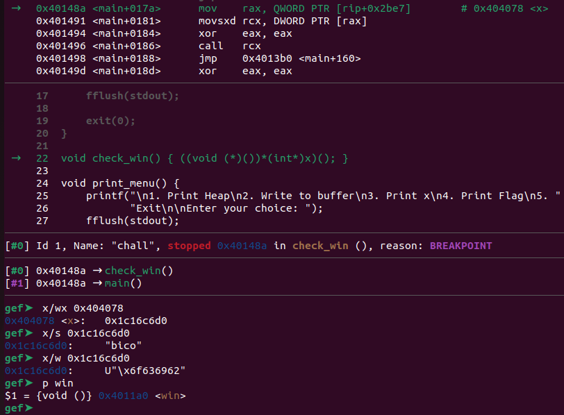

# heap 2
Challenge Description:
> Can you handle function pointers?

CTF: <b>picoCTF</b> (picoGym)<br>Difficulty: <b>Medium</b>

<b>[Jump to solution](#solution)</b>

## Hints
Here are the hints provided by the challenge author.
<details>
<summary>Hint 1</summary>

> Are you doing the right endianness?
</details>

## Procedure
Things heat up a bit, in that it becomes easier to write a pwntools script than to solve the challenge in the command line. From running the program, disassembling `main` in gdb, and/or looking at the source code, we can observe that selecting option `4` to print the flag jumps to whatever code is stored at the address denoted by the contents of `x`.

> 
```c
void check_win() { ((void (*)())*(int*)x)(); }

int main(void) {

    // Setup
    init();

    int choice;

    while (1) {
        print_menu();
	if (scanf("%d", &choice) != 1) exit(0);

        switch (choice) {
        case 1:
            // print heap
            print_heap();
            break;
        case 2:
            write_buffer();
            break;
        case 3:
            // print x
            printf("\n\nx = %s\n\n", x);
            fflush(stdout);
            break;
        case 4:
            // Check for win condition
            check_win();
            break;
        case 5:
            // exit
            return 0;
        default:
            printf("Invalid choice\n");
            fflush(stdout);
        }
    }
}
```

From looking around in gdb, we can see the address of `win` is `0x4011a0`, so that's what we want to overwrite `x` with. 

```
$ python3 heap-2.py
hammy{u win - hammy}
$ 
```

## Solution
1. Input something that is 32 characters long, followed by the address of `win`.
2. Print the flag by entering `4` as your choice. This will jump to the code stored at the address denoted by `x`, which should now contain the address of `win`.