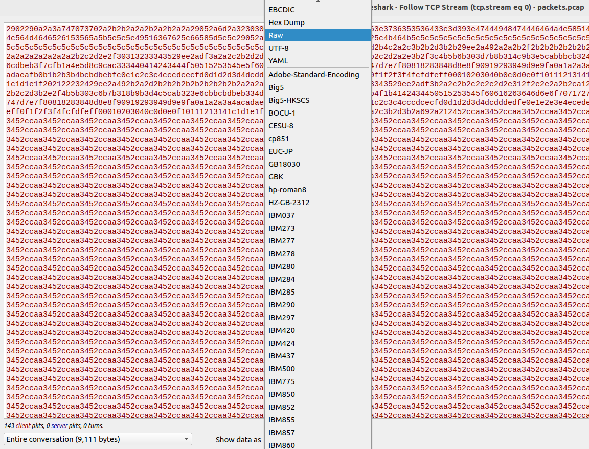

# Silent Stream
Challenge Description:
> We recovered a suspicious packet capture file that seems to contain a transferred file. The sender was kind enough to also share the script they used to encode and send it. Can you reconstruct the original file?

CTF: <b>picoCTF 2026</b>
<br>Points: <b>200</b>
<br>Difficulty: <b>Medium</b>

<b>[Jump to solution](#solution)</b>

## Hints
Here are the hints provided by the challenge author.
<details>
<summary>Hint 1</summary>

> The encoding script is a clue, focus on what it's doing to each byte before it's sent.
</details>
<details>
<summary>Hint 2</summary>

> The flag is hidden inside the file, try reconstructing and opening it.
</details>
<details>
<summary>Hint 3</summary>

> Don't rely on everything you see including flag format
</details>

## Procedure
The challenge description mentions a file transfer and also gives us the method in which the file bytes are encoded before being sent. What we probably have to do is follow a stream in the PCAP, grab all of the bytes, decode the bytes according to the given encoding scheme, and then reconstruct the original file with the decoded bytes.

In Wireshark, we can follow the TCP stream by navigating to `Analyze > Follow > TCP Stream` at the top of the window. We can then display the result as `raw` and copy the contents into a Python script.
> 

This gives us all the raw hexadecimal bytes from the data of all TCP packets in the stream (with some newline characters that we need to skip).

The given encoding scheme shows that for each byte B in the original file transmitted in the TCP data, `B = (B + 42) % 256`. Therefore, the initial plan of attack is to:
1. For each byte in the raw TCP stream data, subtract 42 from it (mod 26).
2. Convert each byte to a character using `chr()` and print out the result of concatenating all the decoded bytes to see what kind of file we might be dealing with.

Doing the above gives us a recognizable file header:
```
$ python3 silent-stream.py 
ÿØÿàJFIFÿÛC
...
```
We can see `JFIF` in the header so this might be a `jpg` file or something similar. If we simply write all the bytes to a new file and open it, we get an image showing the flag.

## Solution
1. For each raw byte B in the TCP stream, decode it by computing `B = (B+42)%256`.
2. Concatenate the decoded bytes and write the bytes to a new file to get the original transmitted file. It will be an image showing the flag.
