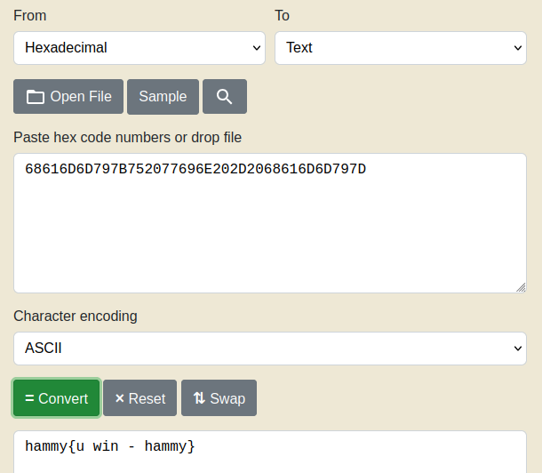

# packer
Challenge Description:
> Reverse this linux executable?

CTF: <b>picoCTF</b> (picoGym)<br>Difficulty: <b>Medium</b>

<b>[Jump to solution](#solution)</b>

## Hints
Here are the hints provided by the challenge author.
<details>
<summary>Hint 1</summary>

> What can we do to reduce the size of a binary after compiling it.
</details>

## Procedure
As suggested by the challenge name and hint, the binary is probably packed. From solving `unpackme`, we can try using `upx-ucl` to unpack the binary and reveal more information about it in gdb.
```
$ upx-ucl -d out
                       Ultimate Packer for eXecutables
                          Copyright (C) 1996 - 2020
UPX 3.96        Markus Oberhumer, Laszlo Molnar & John Reiser   Jan 23rd 2020

        File size         Ratio      Format      Name
   --------------------   ------   -----------   -----------
    872088 <-    336512   38.59%   linux/amd64   out

Unpacked 1 file.
```
Towards the end of `main` we can see an instruction `test eax, eax` followed by a branch between two `puts` calls. This looks like what could be the decision point between winning and losing, and fortunately the arguments to `puts` are hardcoded somewhere in a non-variable code address:
```
   0x0000000000401f47 <+482>:	test   eax,eax
   0x0000000000401f49 <+484>:	jne    0x401f65 <main+512>
   0x0000000000401f4b <+486>:	lea    rdi,[rip+0x930f6]        # 0x495048
   0x0000000000401f52 <+493>:	call   0x418c00 <puts>
   0x0000000000401f57 <+498>:	lea    rax,[rbp-0x80]
   0x0000000000401f5b <+502>:	mov    rdi,rax
   0x0000000000401f5e <+505>:	call   0x418c00 <puts>
   0x0000000000401f63 <+510>:	jmp    0x401f71 <main+524>
   0x0000000000401f65 <+512>:	lea    rdi,[rip+0x93150]        # 0x4950bc
   0x0000000000401f6c <+519>:	call   0x418c00 <puts>
   0x0000000000401f71 <+524>:	mov    rsp,rbx
   0x0000000000401f74 <+527>:	mov    eax,0x0
   0x0000000000401f79 <+532>:	mov    rbx,QWORD PTR [rbp-0x18]
   0x0000000000401f7d <+536>:	xor    rbx,QWORD PTR fs:0x28
   0x0000000000401f86 <+545>:	je     0x401f8d <main+552>
   0x0000000000401f88 <+547>:	call   0x454e20 <__stack_chk_fail_local>
   0x0000000000401f8d <+552>:	mov    rbx,QWORD PTR [rbp-0x8]
   0x0000000000401f91 <+556>:	leave  
   0x0000000000401f92 <+557>:	ret    
End of assembler dump.
gef➤  x/s 0x495048
0x495048:	"Password correct, please see flag: 68616D6D797B752077696E202D2068616D6D797D"
gef➤  x/s 0x4950bc
0x4950bc:	"Access denied"
```
We can get the flag after converting that hex string to readable text.
> 

## Solution
1. Unpack the binary using `upx-ucl -d out` (optional)
2. Examine the address `0x495048` in gdb and convert the hex string to readable text.
    - If you didn't unpack the executable, you have to run the program and then `Ctrl+C` at the input before examining.
